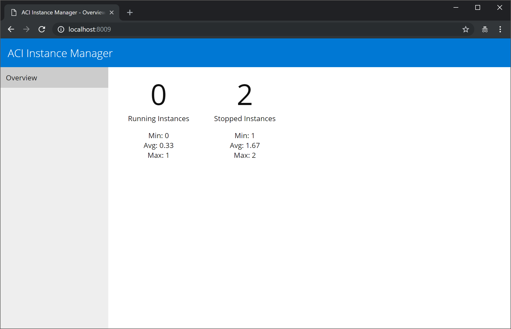

## ACI Deployment API

This project presents an API shim to deploy pre-configured Azure Container Instances on the fly, and give a preliminary dashboard to monitoring status of the deployed / running images. 

### What problems does this solve?

The target use case for this sample application is client applications (i.e., mobile, web, desktop) that should not / do not have enough priviledges to directly call the Azure management API's needed for deploying new resources (such as ACI instances). The application leverages a service principal that has the required isloated priviledges without needed to give extended permissions to end user/client applications.

### Additional Topics

* [Architecture Overview](docs/ArchitectureOverview.md)
* [Reporting Overview](docs/ReportingOverview.md)
* [Container Group Reuse](docs/ContainerGroupReuse.md)
* [Container Group Naming](docs/ContainerGroupNaming.md)

### Authentication / Authorization

While this application provides a broker to make Azure resource calls on-behalf of another less-priviledged user, the application itself doesn't currently make any assumptions or provide any AuthN/AuthZ itself. For Azure AppService specificly, it is recommended to enable Easy Auth to ensure the application is only called from an authorized context.

### API Methods

The following API methods are exposed from this application:

* `GET /api/deployments`
    * This lists all active deployments, and currently returns the same JSON format that the Azure REST api does.
* `POST /api/deployments`
    * This requires a body payload describing the number of CPU's and memory that are requested:
        * `{numCpu:2, memoryInGB: 2}`
    * You can optionally specify a tag for the container image:
        * `{numCpu:2, memoryInGB: 2, tag: latest}`
    * Note this call submits the deployment, and will return with a status of "Pending". It is up to clients to poll instance status before using.
* `GET /api/deployments/{deployment-name}`
    * This will return details about the specific deployment.
* `DELETE /api/deployments/{deployment-name}`
    * This removes (deletes) the specified deployment. Note this does *NOT* stop the instance; rather the entire container group resource is deleted.
* `POST /api/deployments/{deployment-name}/stop`
    * This stops (but does not delete) the specified deployment. Note stopped deployments may be re-used later (see [Container Group Reuse](docs/ContainerGroupReuse.md))

### Building

There are tasks defined in `package.json` that are used to build the application. The most common one will be `npm run build`, which will create the `/dist` folder that is to be used for final depoloyment. 

Note that on Azure AppServices environments, this folder should be the root of the ZIP deployment package.

### Deployment

The application is designed to be deployed as a Web App on Azure AppService (see "[Why App Service?](#Why-App-Service)" below) using the scripts in the `deploy` folder. Modify these as needed for your particular environemnt. Note that there are some long-running background jobs (~4 hours, located in `/src/cleanup-tasks.ts` which require ensuring the WebApp is set to `AlwaysOn`).

Note that the following environment variables will need set in order for the application to run. 

```
TENANT_ID=
CLIENT_ID=
CLIENT_SECRET=
SUBSCRIPTION_ID=
REGION=
RESOURCE_GROUP_NAME=
CONTAINER_IMAGE=
CONTAINER_PORT=
CONTAINER_OS_TYPE=
REPORTING_REFRESH_INTERVAL=
```

If you're using a custom Docker registry and/or require credentials, set the following variables:

```
CONTAINER_REGISTRY_HOST=
CONTAINER_REGISTRY_USERNAME=
CONTAINER_REGISTRY_PASSWORD=
```

For local development, you may place a `.env` file in your root folder to set these variables.

### Why App Service?

This specific project was intentionally deployed as a single Web App to help facilitate simple deployments for teams new to Azure. However, it is a logical next step to decompose the appliction into a more microservice-based approach, likely using Functions, API Management, and some coordinating store (such as Redis or CosmosDB). 

Note however, that the deployment will necessarily need to be more complicated, and definitely has more moving parts. This needs careful consideration, as it will have impact on the team(s) that will be deploying, developing, and maintaining the solution.

### Future Work

The dashboarding experience is rather limited right now, but the intention is to give a better overview on the history of utilization. Note that the reporting data is ephemeral and held only in-memory on the nodes. This needs moved into a persistent storage location.


