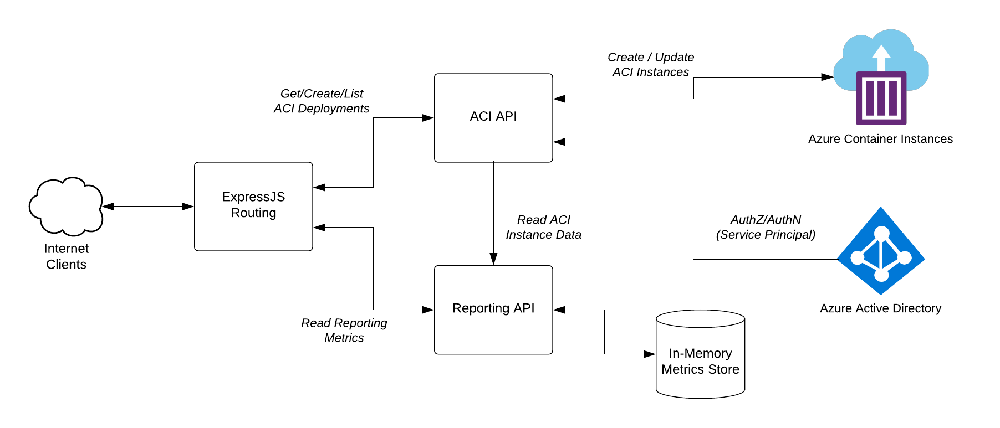
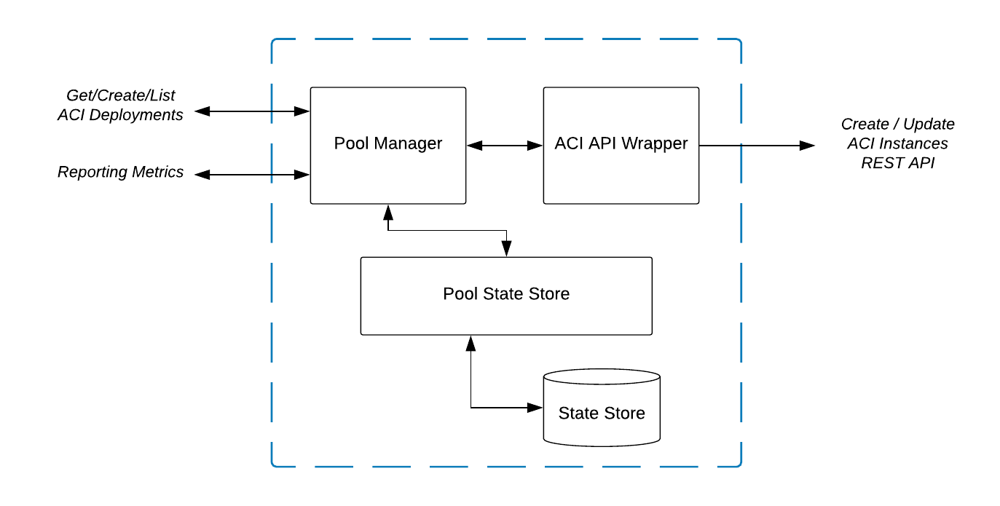
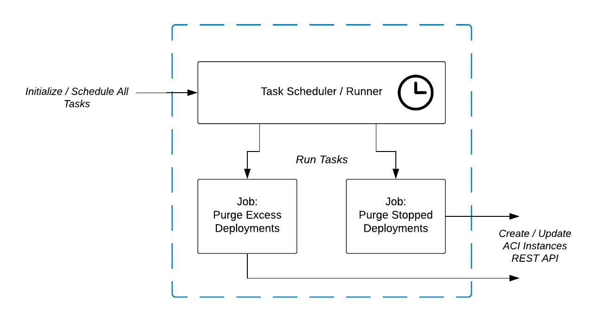

## Architecture Overview

The overall application architecture is show in the following diagram:

Note this applicaiton is serving as an API intermediary between requesting clients and the actual management plane API's in Azure. This allow proper seperation of security contexts, enabling clients to operate without the need to have the full deployment priviledges required to create resources. 

### ACI API

Drilling into the archtiecture diagram above (on the "ACI API" block), we can see the internal relationship between the pool manager, pool state store, and ACI API methods as shown below:

Note that the pool state store is leveraging the shared file system of Azure App Service that provides cluster-wide storage to each member of a given deployment.

### Scheduled Tasks

All background jobs are handled by an ITaskRunner instance that is in charge of scheduling and intializing child jobs. In later bulids these jobs could be more dynamic / data driven, but currently these are simply specified in code.

Drilling into the "Scheduled Tasks" block on the top digram gives an idea of how these componets are related:

