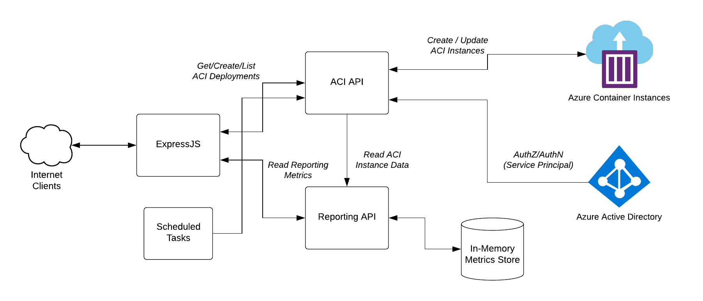

## Architecture Overview

The overall application architecture is show in the following diagram:

Note this applicaiton is serving as an API intermediary between requesting clients and the actual management plane API's in Azure. This allow proper seperation of security contexts, enabling clients to operate without the need to have the full deployment priviledges required to create resources. 

### Call Sequence

A typical call sequence will look something like the following:

